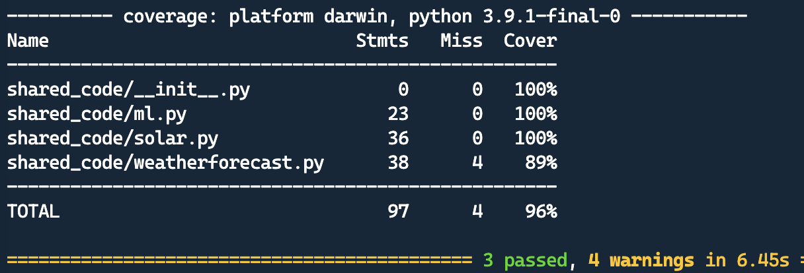
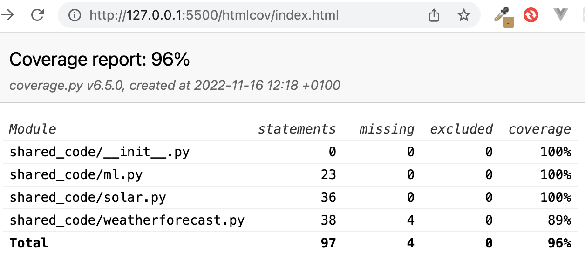
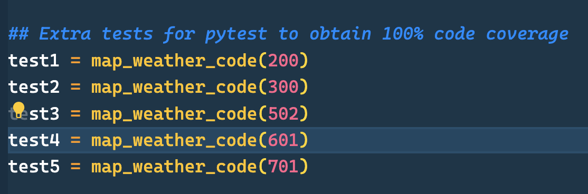
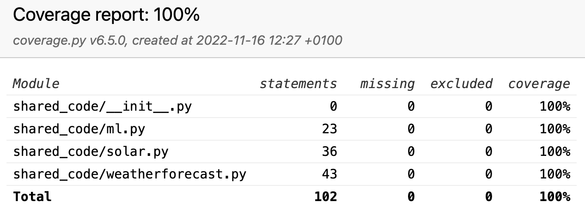

[](https://www.gnu.org/licenses/gpl-3.0)
[](https://github.com/tribp/solar-forecast-api/actions/workflows/main_solar-forecast-api.yml)
[](https://github.com/tribp/solar-forecast-api/actions/workflows/dev_solar-forecast-api-dev.yml)

### References:

- [Build Real-World Microservices with Python](https://www.youtube.com/watch?v=SqFFCTNyi88&t=2466s)

## DevOps Structure

1. Create Python virtual Environment `python3 -m venv ~/.venv`
2. Create empty files: `Makefile`, `requirements.txt`, `Dockerfile`, `shared_code/__init__.py`
3. Populate `Makefile`
4. Improve test coverage
5.

### 3. Populate `Makefile`

We create a makefile:

Advantage:

- we can incrementally check every step in the local cli before runnin the Github workflow
  - eg: make test
- we simplify the steps in the workflow

```
install:
	#install commands
	pip install --upgrade pip &&\
	pip install -r requirements.txt
format:
	#format code
	black *.py shared_code/*.py
lint:
	#pylint with no refactor or convention msg's
	pylint --errors-only --disable=no-self-argument --extension-pkg-whitelist='pydantic' *.py shared_code/*.py
test:
	#test
	python -m pytest -vv --cov=shared_code test_api.py
build:
    #build container
deploy:
	#deploy
all: install format lint test deploy
```

### 4. Improve test coverage

**Goal:** We want to execute, `cover`, all lines of code to check execution.

#### 4.1 run pytest

**Step 1:**: We have following in our makefile

```
test:
	#test
	python -m pytest -vv --cov=shared_code test_api.py
```

**Step 2:** We can first run locally

`make test`



#### 4.2 Find `uncovered` code

Execute in cli: `coverage html`

This will create a new foled `htmlcov`and open index.html in browser (eg via liveserver)



**Click:** on the files in the browser to reveal the uncoverd lines

#### 4.3 Cover 100%

Eliminate unnecessary code or add some code for testing purpuses.

**Eg adding tests:** Here we added some code in the library `weatherforcast.py` to cover or run every single line of code.





# Appendix:

## Build a your docker image

```
# Build your image with name = `solar-forecast-api`
docker build -t solar-forecast-api .

# Run a container it locally
docker run -p 8080:8080 --name -e OPENWEATHERMAP_API_KEY='<yourAPIkey>' cont_SFA solar-forecast-api
```
