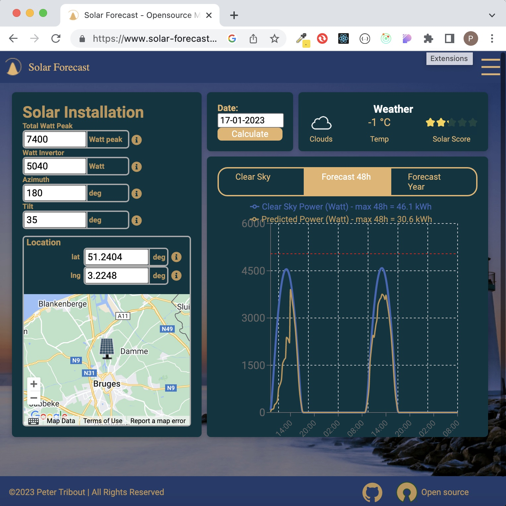
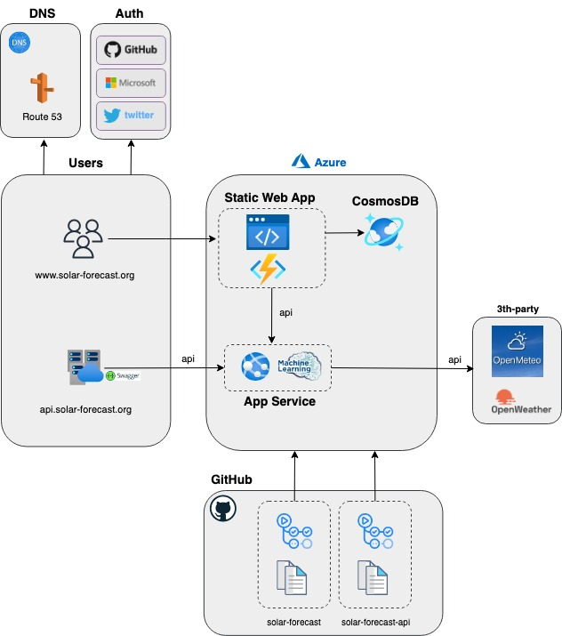

[](https://www.gnu.org/licenses/gpl-3.0)
[](https://github.com/tribp/solar-forecast-api/actions/workflows/main_solar-forecast-api.yml)
[](https://github.com/tribp/solar-forecast-api/actions/workflows/dev_solar-forecast-api-dev.yml)

# solar-forecast-api

# Solar - Forecast

TOC:

1. Intro
2. Concept
3. Architecture

## 1. Intro

**Goal:** Calculating the power production of your solar installation and predicting your solar energy for the next 7 days, also available as an API for integration with a HEMS (Home Energy Management System) like Home Assistant or others.

**Calculating:**

- `clear sky` Power (Watt) for any given time of day
- `clear sky` Energy(kWh) for any given day
- `Typical real Energy` (kWh) per month and `Total`per year

**Predicting:**

- `Power Prediction` (Watt) for any given time for the next 48h
- `Energy Prediction` (kWh) for the next 48h
- `Typical Prediction` (kWh) per month and `Total`per year



## 2. Concept

There are 2 parts:

**API:**

This is the main part, typically used as a service for a HEMS (Home Energy Management System). An API [solar-forecast-api](https://solar-forecast-api.azurewebsites.net) that gets the `installation data` in the body of a POST request and provides a response for the `clear sky` or `prediction`. You can optionaly specify a "weather provider" (open-meteo or openweathermap) by adding a "query" parameter `provider`in the POST request.

```
curl -X 'POST' \
  'https://solar-forecast-api.azurewebsites.net/forecast?provider=openmeteo' \
  -H 'accept: application/json' \
  -H 'Content-Type: application/json' \
  -d '{
  "date": "21-01-2023",
  "location": {
    "lat": 51,
    "lng": 3.11
  },
  "altitude": 70,
  "tilt": 44,
  "azimuth": 170,
  "totalWattPeak": 7400,
  "wattInvertor": 5040,
  "timezone": "Europe/Brussels"
}'

```

**UI - User Inreface:**

This is a web application [www.solar-forecast.org](https://solar-forecast.org) for visualizing the prediction or as aid for calculating your PV installation or exploring different orientations, dimensions, tilts or seasonal influences like winter and summer.


## 2. Architecture



## CI/CD

[Devop guidlines](./DEVOPS.md)
